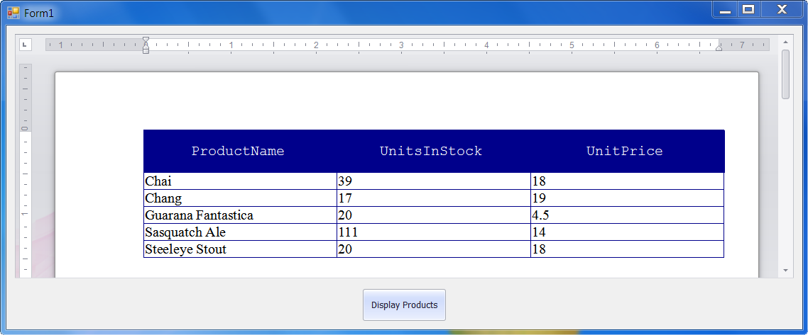

<!-- default badges list -->

<!-- default badges end -->

# Rich Text Editor for WinForms - Create a Table Filled from DataTable contents

This sample illustrates how to display a [DataTable](https://learn.microsoft.com/en-us/dotnet/api/system.data.datatable?view=net-7.0) class instance content in the RichEditControl document.

> [!note]
> Note that the [Mail Merge](https://docs.devexpress.com/WindowsForms/9330/controls-and-libraries/rich-text-editor/mail-merge) feature provides you with an alternative solution to this task.

## Files to Review

* [Form1.cs](./CS/Form1.cs) (VB: [Form1.vb](./VB/Form1.vb))
* [ProductsTable.cs](./CS/ProductsTable.cs) (VB: [ProductsTable.vb](./VB/ProductsTable.vb))

## Documentation

* [Tables in Rich Text Documents](https://docs.devexpress.com/WindowsForms/8306/controls-and-libraries/rich-text-editor/rich-edit-control-document/tables)
